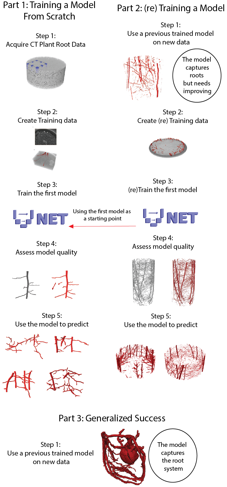

<h1 align="center"> An overview of plant root segmentation using 3D-Unet  </h1>
 

  

 

To run the GoogleColab notebooks click on the .ipynb file above and then click open in colab button. 

#### An overview of the notebooks:
##### Train_3D_Unet_Plant_Roots.ipynb
 - This notebook loads in example training data and splits it into “train”, “quality control” and “test” folders in your Google Drive. The model is then trained on the “train” images and validated on the “quality control” images.  Once the model is trained you can inspect how it performed on the “test” data. Note that due to limitations on colab run times results may not be perfect. 

#####  3D_Unet_general_example.ipynb 
 - This notebook loads in the 3D Unet model trained using (parts) of  this  [data ]( https://zenodo.org/records/13943098) and segments a brachypodium scan courtesy of Sheikh Rabbi. This notebook highlights how the model can get pretty good segmentations from “random” datasets.  

#####  Rootine_Transfer_Learning.ipynb
 - This notebook segments the Rootine-V2 example using the “generalized model” and then retrains that model to produce new segmentations. Note this notebook crops out data to fit into the Colab notebook run times. 

#####  Analysis_Examples_Incorparating_3D_Unet.ipynb
 - This notebook segments data using the 3D-Unet and then skeletonizes the root system, visualizes root density and extracts the pore-network in the rhizosphere.

The GoogleColab notebooks  require “no coding”, to get an initial understanding of the workflow, the only inputs are linking your Google Drive (which is prompted, only need to click approve)
The GoogleColab documents contains a more in depth explanation of the code, below is more of an overview of the benefit 3D-Unet has for segmentation of plant roots in soil along with some explanations to provide context. 

*It is likely you will get frustrated with GoogleColab run times being cut short. The options are then to pay (not recommended if you have access to computational resources) or set up the workflow locally. Setting up locally will require Anaconda being installed, see this    for a quick overview of running the notebooks on your local hardware* 

#### An overview of the publicly available data:

##### <a href="https://zenodo.org/records/14189395"> Training Data - Plant root segmentation using 3D-Unet </a>  
This repository contains the CT data and masks used to train the initial model along with a spreadsheet explaining the datasets. It also contains the 3 models used in the paper (.pytorch files)  
1) 3D_Unet_Root_Model.pytorch - This is the model trained from "Training Data - Plant root segmentation using 3D-Unet", it has the most diverse training data, was trained first and thus became the "generalised" model 
2) Rootine_V2_Example_Model.pytorch - The retrained model used to segment the Rootine-V2 example 
3) Phalempin_Unpublished_Example_Model.pytorch - The retrained model used to segment the Phalempin et al., (unpublished) examples 

##### <a href="https://zenodo.org/records/13984519"> CT Scans of Roots in Soil </a>  
This repository contains the CT data and masks used to (retrain) the models for the Rootine-V2 example and the Phalempin et al., (unpublished), it includes the sub-volumes used for training and the full datasets used to compare the 3D length to 2D washed root length.  

##### <a href="https://zenodo.org/records/13958667"> Generalised Root Segmentation Example Using 3D-Unet </a>  
This repository contains the CT scan of the Brachypodium root from Rabbi (Unpublished) and the “generalised” / 1st 3D-Unet model  

